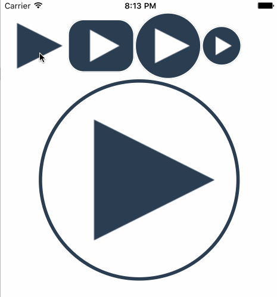

PlaybackButton
========================

[](https://developer.apple.com/iphone/index.action)
[](https://developer.apple.com/swift)
[](http://mit-license.org)
[](https://github.com/dekatotoro/PlaybackButton/issues?state=open)


iOS animation playback button inspired by the playback button of YouTube for web.



##Installation

####CocoaPods
```
pod 'PlaybackButton'
```
  

####Manually
Add the `PlaybackButton.swift` file to your project. 

##Usage

###Setup

Add `import PlaybackButton` in your file

In your ViewController:

```swift
@IBOutlet weak var playbackButton: PlaybackButton!

self.playbackButton.layer.cornerRadius = self.playbackButton.frame.size.height / 2
self.playbackButton.layer.borderWidth = 2.0
self.playbackButton.adjustMargin = 1
self.playbackButton2.duration = 0.3 // animation duration default 0.24

@IBAction func didTapPlaybackButton(sender: AnyObject) {
    if self.playbackButton.buttonState == .Playing {
        self.playbackButton.setButtonState(.Pausing, animated: true)
    } else if self.playbackButton.buttonState == .Pausing {
        self.playbackButton.setButtonState(.Playing, animated: true)
    }
}
```

```swift
var playbackButton: PlaybackButton!

self.playbackButton = PlaybackButton(frame: CGRect(x: 0, y:20, width: 100, height: 100 ))
self.playbackButton.contentEdgeInsets = UIEdgeInsets(top: 8, left: 8, bottom: 8, right: 8)
self.playbackButton.adjustMargin = 0 
self.playbackButton.addTarget(self, action: "didTapPlaybackButton:", forControlEvents: UIControlEvents.TouchUpInside)
self.view.addSubview(self.playbackButton)

func didTapPlaybackButton(sender: AnyObject) {
    if self.playbackButton.buttonState == .Playing {
        self.playbackButton.setButtonState(.Pausing, animated: true)
    } else if self.playbackButton.buttonState == .Pausing {
        self.playbackButton.setButtonState(.Playing, animated: true)
    }
}
```

```
note1: 
The position of PlaybackButton is based on top and left of ContentEdgeInsets.
Please regulate it at the position where wants to locate it.
```

```
note2: 
The value of adjustMargin, please appoint 0-1.
The default is 0.
The left position of play becomes same as pause when adjustMargin is 1.
It is suitable to place PlaybackButton in the middle of view in the case of 0.
```

## Requirements
Requires Swift2.0 and iOS 8.0 and ARC.  
If you want to use even iOS7.0, please to import the code directly.  

## Features
- Highly customizable
- Complete example


## Contributing

Forks, patches and other feedback are welcome.

## Creator

[Yuji Hato](https://github.com/dekatotoro) 
[Blog](http://buzzmemo.blogspot.jp/)

## License

PlaybackButton is available under the MIT license. See the LICENSE file for more info.
